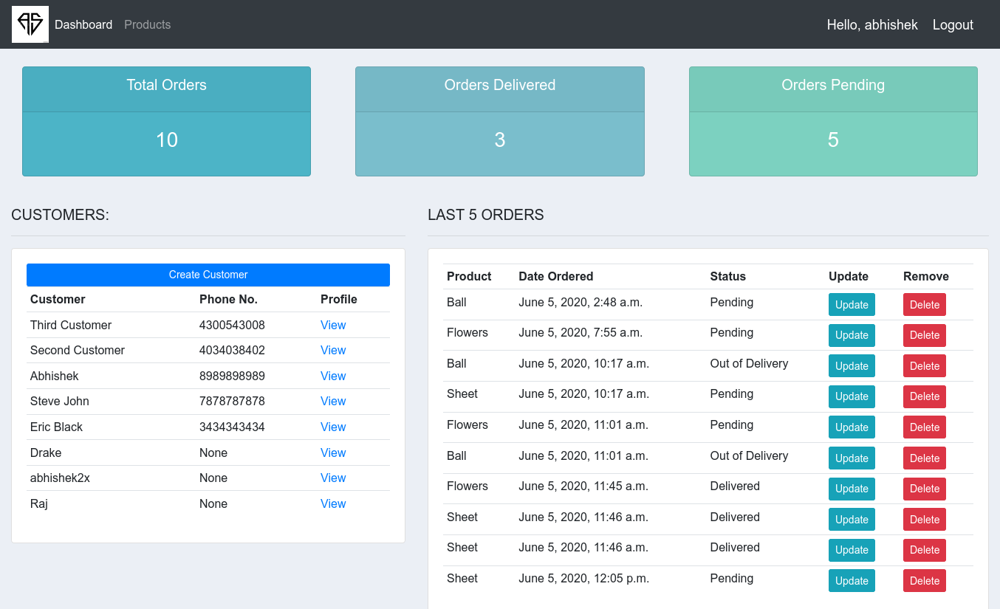
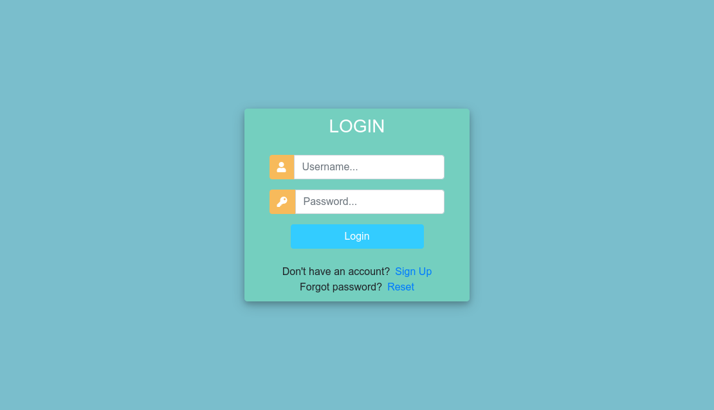
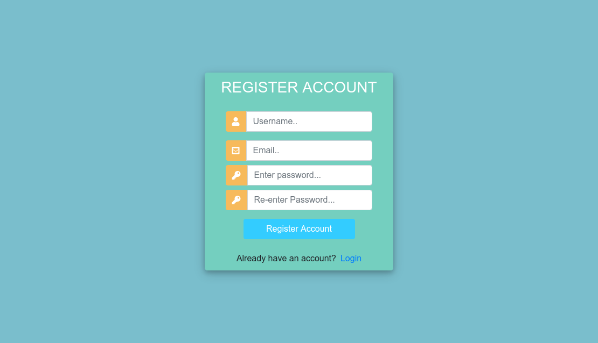
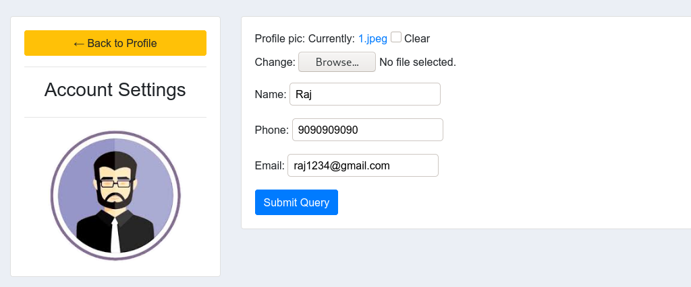
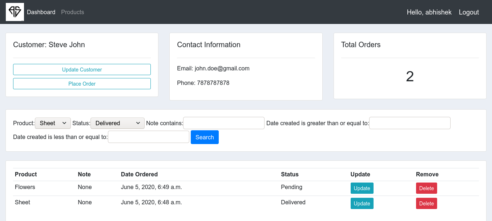

# Customer Management Platform(CRM)

***

***

## It is a Customer Management Platform(CRM) which is developed in python's powerful framework, Django.
**It is a Customer management app which maintains track for their orders. Users can Create, Read, Update, and Delete their Orders. Each User will have a Personal Dashboard.**

***

## Some of the major concepts involved in this #application:

* CRUD implementation

* Custom User model

* Django Custom decorators

* Inline Formsets

* User Login and Registration Authentication

* Linking User modal with Custom model

* Custom Django Middleware

* PyPI django_flters and whitenoise package

* Groups and permissions

Database used: Sqlite
Hosted on Heroku

***

This projects made me familiar with the core concepts of Django and how they are implemented.

***

### Demo
Link: <a href="https://my-first-app-crm.herokuapp.com">View Demo<a/>

***
